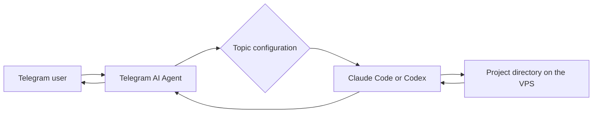

# Telegram AI Agent Starter Kit

This is a public, reusable Telegram wrapper for Claude Code and Codex. It turns
Telegram into a remote control surface for a full AI agent running on your own
Linux server: send tasks from a phone, attach files or voice notes, watch the
work, and receive finished documents back in Telegram.

The Starter Kit contains no personal tokens, Telegram IDs, private skills,
prompts, work documents, or session history. Private values are created only in
local runtime files that Git ignores.

## The foundation

The system combines three components:

- Telegram as the familiar user interface;
- Claude Code or Codex CLI as the agent that reads files and runs tools;
- a VPS or Linux computer as the persistent project environment.



Each Telegram forum topic routes work to a project directory. The directory,
not Telegram, holds the project's files, instructions, tools, and any custom
skills you may add later.

## Included capabilities

- one isolated Telegram topic per project;
- Claude Code or Codex selection per topic;
- persistent `tmux` sessions that survive bot restarts;
- saved-session recovery with `/resume`;
- live terminal controls through `/tui`;
- `verbose`, `live`, and `minimal` progress modes;
- text, photos, documents, forwarded-message batches, and optional voice input;
- agent-to-Telegram message and file delivery;
- systemd autostart and crash recovery;
- an allowlist of authorized Telegram users.

No custom skills are required. Start with the generic runtime, then add private
project instructions only when you have a repeatable workflow worth encoding.

## Requirements

- a Linux server or VPS;
- Python 3.12 or newer;
- [`uv`](https://docs.astral.sh/uv/);
- `tmux` for persistent sessions;
- an installed and authenticated Claude Code and/or Codex CLI;
- a Telegram bot created with `@BotFather`;
- your numeric Telegram user ID;
- optionally, a Deepgram key for voice transcription.

Check the environment:

```bash
python3 --version
uv --version
command -v tmux
command -v claude || true
command -v codex || true
```

Only one agent CLI is required.

## Install

Clone the repository and create local configuration from the safe templates:

```bash
git clone https://github.com/pavel-molyanov/telegram-ai-agent.git
cd telegram-ai-agent
uv sync
cp .env.example .env
cp topic_config.example.json topic_config.json
chmod 600 .env topic_config.json
```

Set the two required values in `.env`:

```env
TELEGRAM_BOT_TOKEN=token-from-botfather
ALLOWED_USER_IDS=[123456789]
```

Keep the token and real user ID in `.env` only. Never paste them into a README,
prompt file, example config, or public issue.

Run the bot in the foreground first:

```bash
uv run telegram-bot
```

Send `/start` and one normal text message to the bot. Once the agent answers,
configure systemd using the [main guide](../../README.md#autostart-with-systemd).

## Create the first project topic

A private bot chat is enough for a single assistant. For multiple projects,
create a Telegram supergroup, enable forum topics, and add the bot as an admin.

Create a topic, send it a message, and configure the new entry in your local
`topic_config.json`:

```json
{
  "topics": {
    "42": {
      "name": "My Project",
      "type": "project",
      "mode": "free",
      "cwd": "/home/user/projects/my-project",
      "mcp_config": null,
      "stream_mode": "live",
      "exec_mode": "tmux",
      "engine": "codex",
      "model": null
    }
  }
}
```

Replace the example topic ID, path, and engine as needed. The real
`topic_config.json` is ignored by Git and must remain private.

For daily project work, prefer `exec_mode: tmux`, `stream_mode: live`, and one
project directory per Telegram topic.

## Main commands

- `/new`: begin a new logical session;
- `/cancel`: stop the current task;
- `/mode`: select subprocess or persistent `tmux` execution;
- `/engine`: switch between Claude Code and Codex;
- `/stream`: select progress delivery;
- `/resume`: continue a saved session;
- `/tui`: view and control the live terminal;
- `/kill`: stop the active `tmux` session.

## Extend it safely

For each new workflow:

1. create a separate project directory;
2. add its documents, templates, and instructions;
3. bind the directory to a Telegram topic through `cwd`;
4. add private skills or scripts only after the workflow becomes repeatable.

This keeps the Telegram runtime reusable while private knowledge remains in
separate, private projects.

## Privacy checklist

Before publishing a fork or sharing an archive, verify that:

- `.env` and `topic_config.json` are not tracked;
- `.mcp.json`, `.mcp.bot.json`, session JSON, and `tmux_sessions/` are absent;
- there are no tokens, API keys, passwords, real Telegram IDs, or personal paths;
- there are no work documents, private prompts, or custom skills;
- `git status --ignored --short` marks local runtime files with `!!`;
- no secret exists in Git history. If a token was ever published, removing it
  from the latest commit is not enough—rotate it.

See the [main README](../../README.md) for the complete operator guide.
