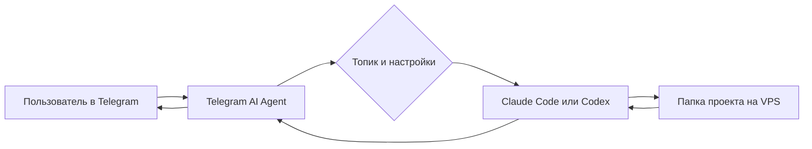

# GSD Starter Kit

Это готовая публичная Telegram-обвязка для Claude Code и Codex. Она превращает
Telegram в удалённый интерфейс к полноценному AI-агенту на вашем Linux-сервере:
можно отправлять задачи с телефона, прикладывать файлы и голосовые сообщения,
наблюдать за работой и получать готовые документы обратно.

В Starter Kit нет чужих токенов, Telegram ID, личных скиллов, приватных
промптов, рабочих документов и истории сессий. Всё личное создаётся только в
локальных файлах вашей установки и исключено из Git.

## Что стало основой системы

Система построена на трёх компонентах:

- Telegram — привычный интерфейс и единая точка входа;
- Claude Code или Codex CLI — агент, который читает файлы, запускает команды и
  выполняет работу;
- VPS или другой Linux-компьютер — постоянная рабочая среда, где находятся
  проекты, инструменты и история.



Telegram здесь не хранит профессиональную логику. Каждый форум-топик только
направляет запрос в нужную папку проекта. В ней агент находит код, документы,
инструкции и, если они появятся позднее, пользовательские skills.

## Что умеет публичная версия

- отдельный Telegram-топик для каждого проекта;
- выбор Claude Code или Codex для конкретного топика;
- постоянные `tmux`-сессии, переживающие перезапуск бота;
- восстановление старых сессий через `/resume`;
- управление живым терминалом через `/tui`;
- режимы показа прогресса `verbose`, `live` и `minimal`;
- текст, фотографии, документы, пачки пересланных сообщений;
- голосовые сообщения при подключении Deepgram;
- отправка готовых сообщений и файлов из агента обратно в Telegram;
- автозапуск и восстановление после сбоя через systemd;
- доступ только для явно разрешённых Telegram-пользователей.

Личные skills для старта не нужны. Сначала можно использовать систему как
универсальный удалённый доступ к Claude Code или Codex, а профессиональные
инструкции добавлять позже под свои процессы.

## Что понадобится

- Linux-сервер или VPS;
- Python 3.12 или новее;
- [`uv`](https://docs.astral.sh/uv/);
- `tmux` для постоянных сессий;
- установленный и авторизованный Claude Code и/или Codex CLI;
- Telegram-бот, созданный через `@BotFather`;
- собственный числовой Telegram user ID;
- опционально — ключ Deepgram для распознавания голосовых сообщений.

Проверьте окружение:

```bash
python3 --version
uv --version
command -v tmux
command -v claude || true
command -v codex || true
```

Достаточно одного из двух CLI — Claude Code или Codex.

## Установка

Клонируйте репозиторий и создайте локальные конфиги из безопасных шаблонов:

```bash
git clone https://github.com/pavel-molyanov/telegram-ai-agent.git
cd telegram-ai-agent
uv sync
cp .env.example .env
cp topic_config.example.json topic_config.json
chmod 600 .env topic_config.json
```

Откройте `.env` и заполните два обязательных значения:

```env
TELEGRAM_BOT_TOKEN=token-from-botfather
ALLOWED_USER_IDS=[123456789]
```

Для русского интерфейса оставьте:

```env
BOT_LANG=ru
```

Токен и реальный user ID должны находиться только в `.env`. Не вставляйте их в
README, prompt-файлы, примеры конфигурации или сообщения в публичных issue.

Запустите бота сначала в терминале:

```bash
uv run telegram-bot
```

Отправьте боту `/start`, затем обычное текстовое сообщение. Если агент отвечает,
базовая установка готова. После этой проверки можно настроить systemd по
[основной инструкции](../../README.ru.md#автозапуск-через-systemd).

## Первый проектный топик

Для одного помощника достаточно личного чата с ботом. Для нескольких проектов
удобнее создать Telegram supergroup, включить forum topics и добавить бота
администратором.

Создайте топик, отправьте в него любое сообщение и настройте появившуюся запись
в локальном `topic_config.json`:

```json
{
  "topics": {
    "42": {
      "name": "My Project",
      "type": "project",
      "mode": "free",
      "cwd": "/home/user/projects/my-project",
      "mcp_config": null,
      "stream_mode": "live",
      "exec_mode": "tmux",
      "engine": "codex",
      "model": null
    }
  }
}
```

Замените только примерный ID топика, путь и при необходимости `engine`.
Реальный `topic_config.json` исключён из Git и не должен публиковаться.

Для повседневной работы рекомендуются:

- `exec_mode: tmux` — сохраняет живую сессию агента;
- `stream_mode: live` — показывает прогресс без множества сообщений;
- отдельная папка и отдельный Telegram-топик для каждого проекта.

## Основные команды

- `/new` — начать новую логическую сессию;
- `/cancel` — остановить текущую задачу;
- `/mode` — выбрать обычный запуск или постоянную `tmux`-сессию;
- `/engine` — переключить Claude Code и Codex;
- `/stream` — выбрать способ показа прогресса;
- `/resume` — продолжить сохранённую сессию;
- `/tui` — открыть снимок терминала и нажимать Enter, Esc и стрелки;
- `/kill` — завершить активную `tmux`-сессию.

## Как развивать систему дальше

После запуска можно постепенно добавлять собственные рабочие контуры:

1. создать отдельную папку проекта;
2. положить туда документы, шаблоны и инструкции;
3. привязать папку к Telegram-топику через `cwd`;
4. только затем формализовать повторяющиеся процессы в skills или скриптах.

Так Telegram-обвязка остаётся универсальной, а личная методика и данные живут в
отдельных приватных проектах и не попадают в публичный runtime.

## Чек-лист приватности

Перед публикацией своего fork или отправкой архива проверьте:

- `.env` и `topic_config.json` не отслеживаются Git;
- нет `.mcp.json`, `.mcp.bot.json`, session JSON и папки `tmux_sessions/`;
- нет токенов, API-ключей, паролей, реальных Telegram ID и личных путей;
- нет рабочих документов, приватных prompts и пользовательских skills;
- `git status --ignored --short` показывает локальные runtime-файлы как `!!`;
- секреты не попадали в историю Git. Простого удаления из последнего коммита
  недостаточно, если токен уже был опубликован — его нужно перевыпустить.

Полная документация находится в [README проекта](../../README.ru.md).
